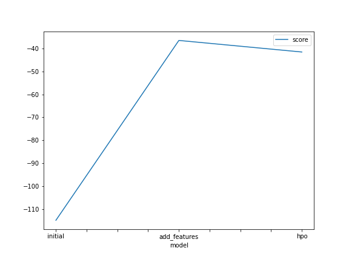
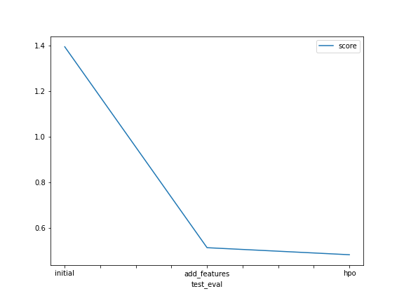
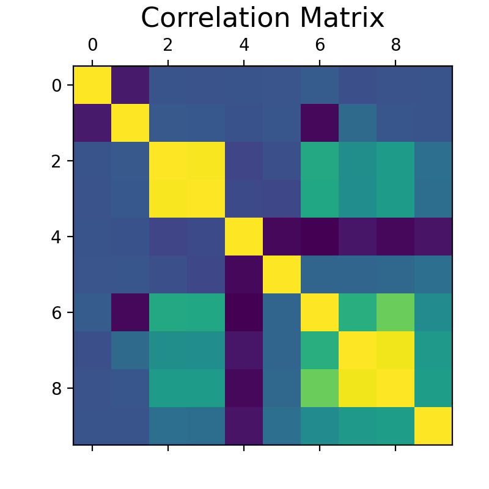

# Report: Predict Bike Sharing Demand with AutoGluon Solution
#### Nasha

## Initial Training
### What did you realize when you tried to submit your predictions? What changes were needed to the output of the predictor to submit your results?
Kaggle doesn't accept value that less than 0. So i had to convert the negative value to zero before submitted.

### What was the top ranked model that performed?
WeightedEnsemble_L3

## Exploratory data analysis and feature creation
### What did the exploratory analysis find and how did you add additional features?
The features - Season and Weather are categorical.
The features - holiday and working day are binary values.
Datetime is a datetime object, and it is transformed to 3 different features - day, month, year, hour, weekday.

### How much better did your model preform after adding additional features and why do you think that is?
Significantly, increase the accuracy of model with feature engineering. Dividing time into hours is impactful because not complex as before.

## Hyper parameter tuning
### How much better did your model preform after trying different hyper parameters?
After, trying different hyperparameter tuning, i realized that model will perform more or less same as without hyperparameter tuning. In the end, my model didn't work well with hyperparameter tuning. 

### If you were given more time with this dataset, where do you think you would spend more time?
1. More time for EDA to improve model prediction. If i could find more bias or something else that could be a new feature.
2. Increase time limit for training model

### Create a table with the models you ran, the hyperparameters modified, and the kaggle score.
|model|time|problem_type|presets|score|
|--|--|--|--|--|
|initial|600|default|best_quality|1.39447|
|add_features|600|regression|best_quality|0.51512|
|hpo|600|regression|best_quality|0.48430|

### Create a line plot showing the top model score for the three (or more) training runs during the project.

### Create a line plot showing the top kaggle score for the three (or more) prediction submissions during the project.

## Summary
Exploratory analysis is very important to produce a good model. In addition, model enhancement can be done by setting hyperparameters. But improvement with hyperparameter tuning doesn't always lead to model improvement like exploratory analysis.

## More Visualization

